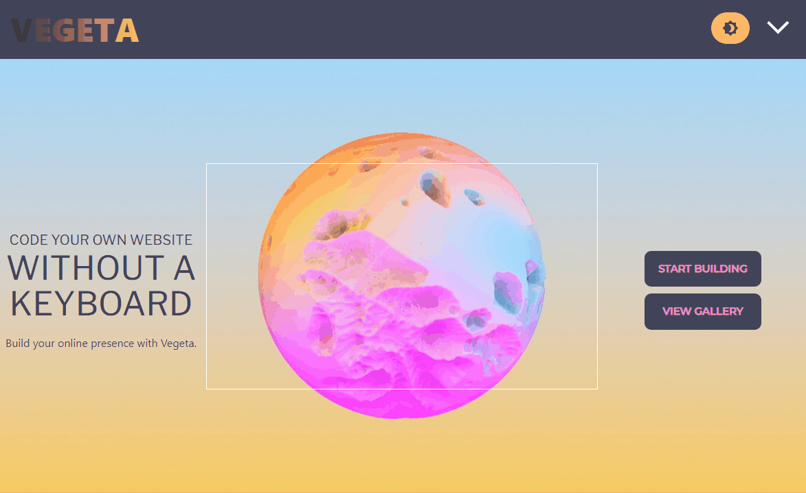

<h1 align="center">VEGETA</h1>

    <a target="_blank" href="https://code-vegeta.herokuapp.com/">Link To Deployed Website</a>

 

    
    
    <!--   -->
    
    

    
    
    
    
    
    
    
    
    

## Description

A true full stack MERN application featureing Stripe, Vitawind, DaisyUI, and GraphQL. Use our app to build your dream website and share design ideas with your friends. 

## Table of Contents 

- [Usage](#usage)
- [License](#license)
- [Contributing Guidlines](#contributing-guidlines)
- [Test Instructions](#test-instructions)
- [Questions](#questions)

## Usage

To get the best experience, go to the deployed website.

## License

This project is using the MIT license. For more information on this and other licenses please reference: [https://choosealicense.com/](https://choosealicense.com/).

## Contributing Guidlines

This project is using the [Contributor Covenant](https://www.contributor-covenant.org/) as a default. Please read over these guidlines before contributing
    

## Questions
Reach out to the developers:
[Jess Olivares](https://github.com/jessoliva),
[Keenan Chiasson](https://github.com/laszlo-ratesic),
[Jonathan Prill](https://github.com/jonathanprill),
[Jordan Sneed](https://github.com/jorddo),
[Jon Taylor](https://github.com/DevJonTaylor/)

